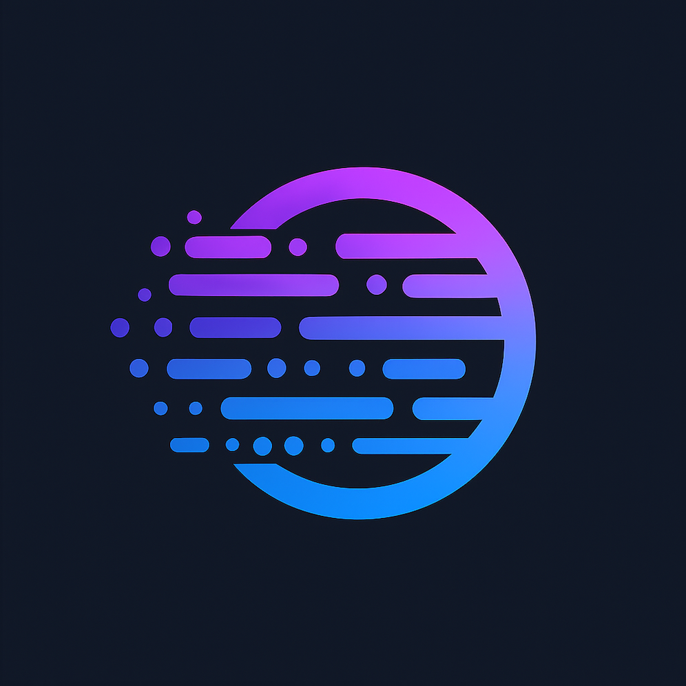

<p align="center">
  
</p>
<h1 align="center">Vezia: The Homebrew for Cloud Infrastructure</h1>

[](https://goreportcard.com/report/github.com/Vezia/vez-cli)
[](https://github.com/Vezia/vez-cli/releases)
[](https://github.com/Vezia/vez-cli/discussions)

`Vezia` is an open-source, developer-centric platform that brings a "serverless-like" experience to managing production-ready cloud infrastructure. Its core component is a powerful command-line tool, `vez`, that acts as a high-level abstraction layer on top of Terraform.

Our mission is to bridge the "Developer Experience Gap" by empowering application developers to self-service their infrastructure needs safely and efficiently.

> Your expensive developers shouldn't be spending their time trying to be amateur DevOps engineers. `Vezia` gives them a clear path to build, without the hassle.

---

## The Core Problem

In modern platform engineering, developers are often expected to manage their own infrastructure. This creates significant challenges:
*   **High Cognitive Load:** Developers spend valuable time on complex infrastructure tasks instead of building product features.
*   **Platform Team Bottlenecks:** Central platform teams are overwhelmed with support tickets, slowing down the entire organization.
*   **Inconsistent & Insecure Environments:** Without a "paved road," infrastructure is often configured inconsistently, leading to security vulnerabilities and operational risk.

`Vezia` solves this by providing a simple, declarative interface for developers to consume a platform team's curated, best-practice infrastructure.

## How It Works: The Two-File System

`Vezia` introduces a clean separation of concerns with two simple YAML files:

1.  **`app.yaml` (The "What"):** A developer-facing manifest where they declare what they need.
    ```yaml
    # app.yaml
    name: my-awesome-app
    resources:
      - id: primary-db
        uses: postgres:v1
      - id: document-storage
        uses: s3-bucket:v1
    ```

2.  **`catalog.yaml` (The "How"):** A platform-team-managed catalog that defines how to build those resources using hardened, pre-approved Terraform modules.
    ```yaml
    # catalog.yaml
    resources:
      - name: postgres:v1
        source: "github.com/my-org/terraform-modules//postgres?ref=v1.2.0"
        # ... plus secure defaults and guardrails
      - name: s3-bucket:v1
        source: "github.com/my-org/terraform-modules//s3?ref=v2.1.0"
        # ...
    ```

The `vez` CLI reads these two files and generates the final, production-ready Terraform code.

## Key Features

*   **Simple, Declarative API:** An intuitive interface for requesting complex infrastructure.
*   **Platform-Driven Governance:** Enables platform teams to enforce security, compliance, and best practices at scale.
*   **Compose, Don't Create:** Leverages the vast ecosystem of public Terraform modules.
*   **GitOps-Ready:** Integrates seamlessly with existing CI/CD and GitOps workflows like Atlantis or GitHub Actions.
*   **Extensible Catalog:** A pluggable system that can be adapted to any organization's needs.

## Getting Started

To get started with `Vezia`, check out our comprehensive **[GETTING_STARTED.md](docs/GETTING_STARTED.md)** guide.

## Community

`Vezia` is a community-driven project. We welcome contributions of all kinds!
*   Join the discussion on **[GitHub Discussions](https://github.com/Vezia/vez-cli/discussions)**.
*   Report bugs or request features on **[GitHub Issues](https://github.com/Vezia/vez-cli/issues)**.

---

Built with ❤️ for platform engineers and application developers.
